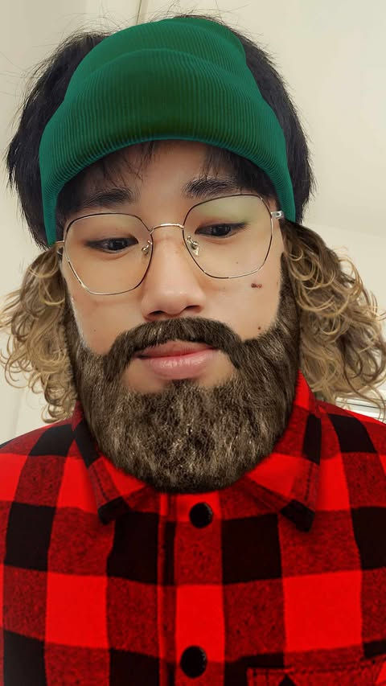
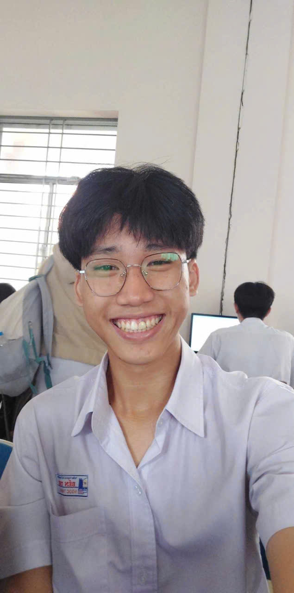
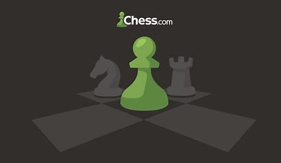
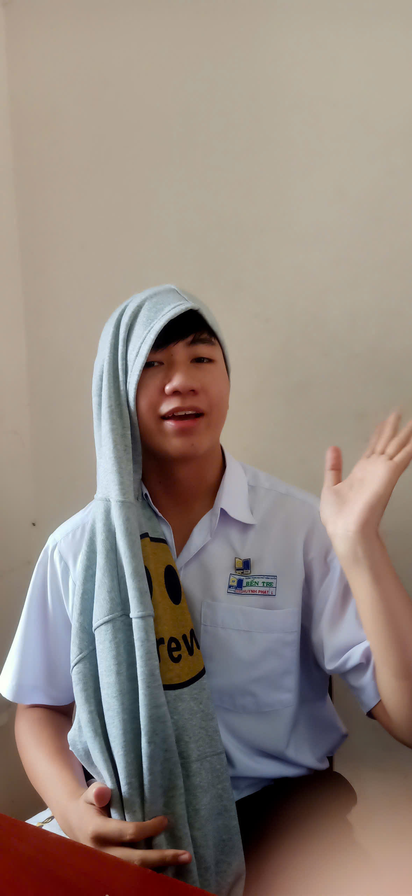

<html lang="vi">
<head>
  <meta charset="UTF-8">
  <meta name="viewport" content="width=device-width, initial-scale=1.0">
  <title>Trang Web Của Tôi</title>
  <link href="https://fonts.googleapis.com/css2?family=Lora&family=Poppins:wght@400;600&display=swap" rel="stylesheet">
  
</head>
<body>
  

    <h1>NGUYỄN NGỌC THỊNH XIN CHÀO</h1>
  

  

    

      Mình tên là Nguyễn Ngọc Thịnh hiện đang theo học tại ngôi trường THPT Chuyên Bến Tre, mình rất hân hạnh được giới thiệu bản thân mình.
    

    

      

        
      

      

        
Thông tin cá nhân

        
Hiện tại mình học lớp 12 Lý, trường THPT Chuyên Bến Tre. Mình nặng 65kg và cao 1,80m

      

    

    

      

        
Nguyện vọng tương lai

        
Mình chọn thi khối Khoa học tự nhiên, nguyện vọng 1 là ngành Vi mạch bán dẫn trường đại học Bách Khoa.

      

      

        
      

    

  

  

    
Sở thích của tôi

    

      

        
        
Đánh cầu lông

        
Môn thể thao giúp tôi rèn luyện sức khỏe và tinh thần đồng đội.

      

      

        
        
Đá bóng

        
Niềm đam mê từ nhỏ, luôn mang lại sự hào hứng.

      

      

        
        
Đánh cờ vua

        
Trò chơi trí tuệ tôi yêu thích để rèn luyện tư duy.

      

      

        
        
Đấu Trường Chân Lý

        
Thỏa sức sáng tạo với chiến thuật và đội hình độc đáo.

      

      

        
        
Ngắm các nàng thơ

        
Khoảnh khắc dịu dàng và cảm hứng cho cuộc sống.

      

    

  

  

    
    
    
  

  

    
&copy; 2025 Nguyễn Ngọc Thịnh - Tất cả các quyền được bảo lưu.

  

</body>
</html>
